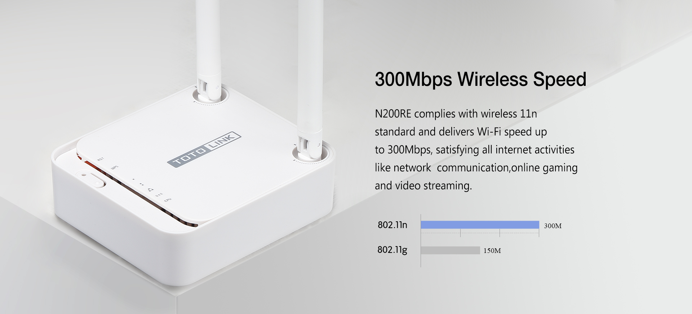

## Langkah

<!--StartFragment-->

1. Pada menu Operation Mode pilih Repeater (range extender), Apply
2. Kemudian masuk ke menu Repeater Setup,

   * Pilih enable, 
   * Setting nama SSID, 
   *  Scan AP (scan ssid wifi yang akan di repeater), pastikan bisa konek
   * setting password  wifi repeater
   * Apply,

<!--EndFragment-->